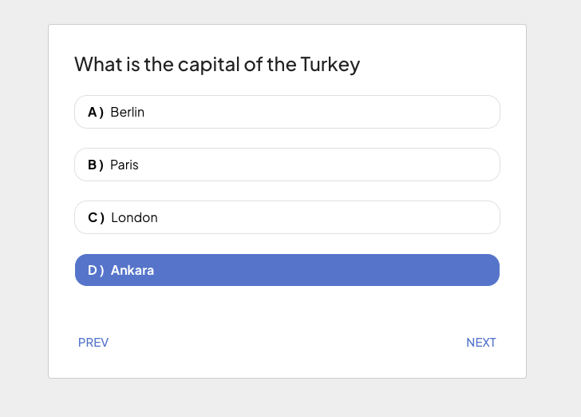

# Xstate Quiz App
[VIEW APP](https://xstate-quiz-app-git-main-hsndmr.vercel.app/)
- This is a quiz app built with xstate and react. It is a simple quiz app that has 10 questions and the user can choose one of the 4 options for each question. The user can also go back to the previous question and change their answer. End of the quiz, the user can see their score and can restart the quiz.
- The project aim is to show how to use xstate with react and how to use xstate to manage state in a React app.

